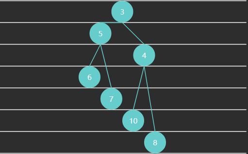
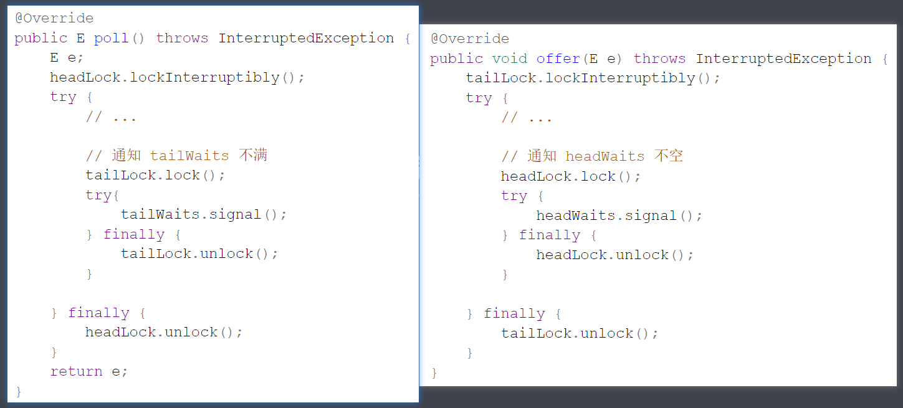

## 2.4 队列

### 1) 概述

  计算机科学中，queue 是以顺序的方式维护的一组数据集合，在一端添加数据，从另一端移除数据。习惯来说，添加的一端称为**尾**，移除的一端称为**头**，就如同生活中的排队买商品

> In computer science, a **queue** is a collection of entities that are maintained in a sequence and can be modified by  the addition of entities at one end of the sequence and the removal of  entities from the other end of the sequence

  先定义一个简化的队列接口

```java
public interface Queue<E> {

    /**
     * 向队列尾插入值
     * @param value 待插入值
     * @return 插入成功返回 true, 插入失败返回 false
     */
    boolean offer(E value);

    /**
     * 从对列头获取值, 并移除
     * @return 如果队列非空返回对头值, 否则返回 null
     */
    E poll();

    /**
     * 从对列头获取值, 不移除
     * @return 如果队列非空返回对头值, 否则返回 null
     */
    E peek();

    /**
     * 检查队列是否为空
     * @return 空返回 true, 否则返回 false
     */
    boolean isEmpty();

    /**
     * 检查队列是否已满
     * @return 满返回 true, 否则返回 false
     */
    boolean isFull();
}
```

### 2) 链表实现

  下面以**单向环形带哨兵**链表方式来实现队列

  

 

  

  代码

```java
public class LinkedListQueue<E>
        implements Queue<E>, Iterable<E> {

    private static class Node<E> {
        E value;
        Node<E> next;

        public Node(E value, Node<E> next) {
            this.value = value;
            this.next = next;
        }
    }

    private Node<E> head = new Node<>(null, null);
    private Node<E> tail = head;
    private int size = 0;
    private int capacity = Integer.MAX_VALUE;

    {
        tail.next = head;
    }

    public LinkedListQueue() {
    }

    public LinkedListQueue(int capacity) {
        this.capacity = capacity;
    }

    @Override
    public boolean offer(E value) {
        if (isFull()) {
            return false;
        }
        Node<E> added = new Node<>(value, head);
        tail.next = added;
        tail = added;
        size++;
        return true;
    }

    @Override
    public E poll() {
        if (isEmpty()) {
            return null;
        }
        Node<E> first = head.next;
        head.next = first.next;
        if (first == tail) {
            tail = head;
        }
        size--;
        return first.value;
    }

    @Override
    public E peek() {
        if (isEmpty()) {
            return null;
        }
        return head.next.value;
    }

    @Override
    public boolean isEmpty() {
        return head == tail;
    }

    @Override
    public boolean isFull() {
        return size == capacity;
    }

    @Override
    public Iterator<E> iterator() {
        return new Iterator<E>() {
            Node<E> p = head.next;
            @Override
            public boolean hasNext() {
                return p != head;
            }
            @Override
            public E next() {
                E value = p.value;
                p = p.next;
                return value;
            }
        };
    }
}
```

### 3) 环形数组实现

  **好处**

1. 对比普通数组，起点和终点更为自由，不用考虑数据移动

2. “环”意味着不会存在【越界】问题

3. 数组性能更佳

4. 环形数组比较适合实现有界队列、RingBuffer 等

   

   **下标计算**

   例如，数组长度是 5，当前位置是 3 ，向前走 2 步，此时下标为 $(3 + 2)\%5 = 0$

   

   $$
   (cur + step) \% length
   $$

* cur 当前指针位置

* step 前进步数

* length 数组长度

  > 注意：
  >
  > * 如果 step = 1，也就是一次走一步，可以在 >= length 时重置为 0 即可

  **判断空**

  

  **判断满**

  

  满之后的策略可以根据业务需求决定

* 例如我们要实现的环形队列，满之后就拒绝入队

  代码

  ```java
  public class ArrayQueue<E> implements Queue<E>, Iterable<E>{
  
    private int head = 0;
    private int tail = 0;
    private final E[] array;
    private final int length;
  
    @SuppressWarnings("all")
    public ArrayQueue(int capacity) {
        length = capacity + 1;
        array = (E[]) new Object[length];
    }
  
    @Override
    public boolean offer(E value) {
        if (isFull()) {
            return false;
        }
        array[tail] = value;
        tail = (tail + 1) % length;
        return true;
    }
  
    @Override
    public E poll() {
        if (isEmpty()) {
            return null;
        }
        E value = array[head];
        head = (head + 1) % length;
        return value;
    }
  
    @Override
    public E peek() {
        if (isEmpty()) {
            return null;
        }
        return array[head];
    }
  
    @Override
    public boolean isEmpty() {
        return tail == head;
    }
  
    @Override
    public boolean isFull() {
        return (tail + 1) % length == head;
    }
  
    @Override
    public Iterator<E> iterator() {
        return new Iterator<E>() {
            int p = head;
            @Override
            public boolean hasNext() {
                return p != tail;
            }
  
            @Override
            public E next() {
                E value = array[p];
                p = (p + 1) % array.length;
                return value;
            }
        };
    }
  }
  ```

  **判断空、满方法2**

  引入 size 

```java
public class ArrayQueue2<E> implements Queue<E>, Iterable<E> {

    private int head = 0;
    private int tail = 0;
    private final E[] array;
    private final int capacity;
    private int size = 0;

    @SuppressWarnings("all")
    public ArrayQueue2(int capacity) {
        this.capacity = capacity;
        array = (E[]) new Object[capacity];
    }

    @Override
    public boolean offer(E value) {
        if (isFull()) {
            return false;
        }
        array[tail] = value;
        tail = (tail + 1) % capacity;
        size++;
        return true;
    }

    @Override
    public E poll() {
        if (isEmpty()) {
            return null;
        }
        E value = array[head];
        head = (head + 1) % capacity;
        size--;
        return value;
    }

    @Override
    public E peek() {
        if (isEmpty()) {
            return null;
        }
        return array[head];
    }

    @Override
    public boolean isEmpty() {
        return size == 0;
    }

    @Override
    public boolean isFull() {
        return size == capacity;
    }

    @Override
    public Iterator<E> iterator() {
        return new Iterator<E>() {
            int p = head;

            @Override
            public boolean hasNext() {
                return p != tail;
            }

            @Override
            public E next() {
                E value = array[p];
                p = (p + 1) % capacity;
                return value;
            }
        };
    }
}
```

  **判断空、满方法3**

* head 和 tail 不断递增，用到索引时，再用它们进行计算，两个问题

  * 如何保证 head 和 tail 自增超过正整数最大值的正确性

  * 如何让取模运算性能更高

* 答案：让 capacity 为 2 的幂

  ```java
  public class ArrayQueue3<E> implements Queue<E>, Iterable<E> {
  
    private int head = 0;
    private int tail = 0;
    private final E[] array;
    private final int capacity;
  
    @SuppressWarnings("all")
    public ArrayQueue3(int capacity) {
        if ((capacity & capacity - 1) != 0) {
            throw new IllegalArgumentException("capacity 必须为 2 的幂");
        }
        this.capacity = capacity;
        array = (E[]) new Object[this.capacity];
    }
  
    @Override
    public boolean offer(E value) {
        if (isFull()) {
            return false;
        }
        array[tail & capacity - 1] = value;
        tail++;
        return true;
    }
  
    @Override
    public E poll() {
        if (isEmpty()) {
            return null;
        }
        E value = array[head & capacity - 1];
        head++;
        return value;
    }
  
    @Override
    public E peek() {
        if (isEmpty()) {
            return null;
        }
        return array[head & capacity - 1];
    }
  
    @Override
    public boolean isEmpty() {
        return tail - head == 0;
    }
  
    @Override
    public boolean isFull() {
        return tail - head == capacity;
    }
  
    @Override
    public Iterator<E> iterator() {
        return new Iterator<E>() {
            int p = head;
  
            @Override
            public boolean hasNext() {
                return p != tail;
            }
  
            @Override
            public E next() {
                E value = array[p & capacity - 1];
                p++;
                return value;
            }
        };
    }
  }
  ```

### 习题

#### E01. 二叉树层序遍历-Leetcode 102

```java
class Solution {
    public List<List<Integer>> levelOrder(TreeNode root) {
        List<List<Integer>> result = new ArrayList<>();
        if(root == null) {
            return result;
        }
        LinkedListQueue<TreeNode> queue = new LinkedListQueue<>();
        queue.offer(root);
        int c1 = 1;        // 本层节点个数
        while (!queue.isEmpty()) {
            int c2 = 0;     // 下层节点个数
            List<Integer> level = new ArrayList<>();
            for (int i = 0; i < c1; i++) {
                TreeNode node = queue.poll();
                level.add(node.val);
                if (node.left != null) {
                    queue.offer(node.left);
                    c2++;
                }
                if (node.right != null) {
                    queue.offer(node.right);
                    c2++;
                }
            }
            c1 = c2;
            result.add(level);
        }
        return result;
    }

    // 自定义队列
    static class LinkedListQueue<E> {

        private static class Node<E> {
            E value;
            Node<E> next;

            public Node(E value, Node<E> next) {
                this.value = value;
                this.next = next;
            }
        }

        private final Node<E> head = new Node<>(null, null);
        private Node<E> tail = head;
        int size = 0;
        private int capacity = Integer.MAX_VALUE;

        {
            tail.next = head;
        }

        public LinkedListQueue() {
        }

        public LinkedListQueue(int capacity) {
            this.capacity = capacity;
        }

        public boolean offer(E value) {
            if (isFull()) {
                return false;
            }
            Node<E> added = new Node<>(value, head);
            tail.next = added;
            tail = added;
            size++;
            return true;
        }

        public E poll() {
            if (isEmpty()) {
                return null;
            }
            Node<E> first = head.next;
            head.next = first.next;
            if (first == tail) {
                tail = head;
            }
            size--;
            return first.value;
        }

        public E peek() {
            if (isEmpty()) {
                return null;
            }
            return head.next.value;
        }

        public boolean isEmpty() {
            return head == tail;
        }

        public boolean isFull() {
            return size == capacity;
        }
    }
}
```

#### Ex1. 设计队列-Leetcode 622

  由于与课堂例题差别不大，这里只给出参考解答

  基于链表的实现

```java
public class Ex1Leetcode622 {

    private static class Node {
        int value;
        Node next;
        Node(int value, Node next) {
            this.value = value;
            this.next = next;
        }
    }
    private final Node head = new Node(-1, null);
    private Node tail = head;
    private int size = 0;
    private int capacity = 0;

    {
        tail.next = head;
    }

    public Ex1Leetcode622(int capacity) {
        this.capacity = capacity;
    }

    public boolean enQueue(int value) {
        if(isFull()) {
            return false;
        }
        Node added = new Node(value, head);
        tail.next = added;
        tail = added;
        size++;
        return true;
    }

    public boolean deQueue() {
        if(isEmpty()) {
            return false;
        }
        Node first = head.next;
        head.next = first.next;
        if (first == tail) {
            tail = head;
        }
        size--;
        return true;
    }

    public int Front() {
        if(isEmpty()) {
            return -1;
        }
        return head.next.value;
    }

    public int Rear() {
        if(isEmpty()) {
            return -1;
        }
        return tail.value;
    }

    public boolean isEmpty() {
        return head == tail;
    }

    public boolean isFull() {
        return size == capacity;
    }
}
```

  注意：

* Leetcode 的实现里 deQueue（出队）返回值是布尔值，并不会返回队头元素
* 它期望用法是先用 Front 返回对头元素，再 deQueue 出队

## 2.5 栈

### 1) 概述

  计算机科学中，**stack** 是一种线性的数据结构，只能在其一端添加数据和移除数据。习惯来说，这一端称之为**栈顶**，另一端不能操作数据的称之为**栈底**，就如同生活中的一摞书

  先提供一个栈接口

```java
public interface Stack<E> {
    /**
     * 向栈顶压入元素
     * @param value 待压入值
     * @return 压入成功返回 true, 否则返回 false
     */
    boolean push(E value);

    /**
     * 从栈顶弹出元素
     * @return 栈非空返回栈顶元素, 栈为空返回 null
     */
    E pop();

    /**
     * 返回栈顶元素, 不弹出
     * @return 栈非空返回栈顶元素, 栈为空返回 null
     */
    E peek();

    /**
     * 判断栈是否为空
     * @return 空返回 true, 否则返回 false
     */
    boolean isEmpty();

    /**
     * 判断栈是否已满
     * @return 满返回 true, 否则返回 false
     */
    boolean isFull();
}
```

### 2) 链表实现

```java
public class LinkedListStack<E> implements Stack<E>, Iterable<E> {

    private final int capacity;
    private int size;
    private final Node<E> head = new Node<>(null, null);

    public LinkedListStack(int capacity) {
        this.capacity = capacity;
    }

    @Override
    public boolean push(E value) {
        if (isFull()) {
            return false;
        }
        head.next = new Node<>(value, head.next);
        size++;
        return true;
    }

    @Override
    public E pop() {
        if (isEmpty()) {
            return null;
        }
        Node<E> first = head.next;
        head.next = first.next;
        size--;
        return first.value;
    }

    @Override
    public E peek() {
        if (isEmpty()) {
            return null;
        }
        return head.next.value;
    }

    @Override
    public boolean isEmpty() {
        return head.next == null;
    }

    @Override
    public boolean isFull() {
        return size == capacity;
    }

    @Override
    public Iterator<E> iterator() {
        return new Iterator<E>() {
            Node<E> p = head.next;
            @Override
            public boolean hasNext() {
                return p != null;
            }

            @Override
            public E next() {
                E value = p.value;
                p = p.next;
                return value;
            }
        };
    }

    static class Node<E> {
        E value;
        Node<E> next;

        public Node(E value, Node<E> next) {
            this.value = value;
            this.next = next;
        }
    }
}
```

### 3) 数组实现

```java
public class ArrayStack<E> implements Stack<E>, Iterable<E>{
    private final E[] array;
    private int top = 0;

    @SuppressWarnings("all")
    public ArrayStack(int capacity) {
        this.array = (E[]) new Object[capacity];
    }

    @Override
    public boolean push(E value) {
        if (isFull()) {
            return false;
        }
        array[top++] = value;
        return true;
    }

    @Override
    public E pop() {
        if (isEmpty()) {
            return null;
        }
        return array[--top];
    }

    @Override
    public E peek() {
        if (isEmpty()) {
            return null;
        }
        return array[top-1];
    }

    @Override
    public boolean isEmpty() {
        return top == 0;
    }

    @Override
    public boolean isFull() {
        return top == array.length;
    }

    @Override
    public Iterator<E> iterator() {
        return new Iterator<E>() {
            int p = top;
            @Override
            public boolean hasNext() {
                return p > 0;
            }

            @Override
            public E next() {
                return array[--p];
            }
        };
    }
}
```

### 4) 应用

  模拟如下方法调用

```java
public static void main(String[] args) {
    System.out.println("main1");
    System.out.println("main2");
    method1();
    method2();
    System.out.println("main3");
}

public static void method1() {
    System.out.println("method1");
    method3();
}

public static void method2() {
    System.out.println("method2");
}

public static void method3() {
    System.out.println("method3");
}
```

  模拟代码

```java
public class CPU {
    static class Frame {
        int exit;

        public Frame(int exit) {
            this.exit = exit;
        }
    }
    static int pc = 1; // 模拟程序计数器 Program counter
    static ArrayStack<Frame> stack = new ArrayStack<>(100); // 模拟方法调用栈

    public static void main(String[] args) {
        stack.push(new Frame(-1));
        while (!stack.isEmpty()) {
            switch (pc) {
                case 1 -> {
                    System.out.println("main1");
                    pc++;
                }
                case 2 -> {
                    System.out.println("main2");
                    pc++;
                }
                case 3 -> {
                    stack.push(new Frame(pc + 1));
                    pc = 100;
                }
                case 4 -> {
                    stack.push(new Frame(pc + 1));
                    pc = 200;
                }
                case 5 -> {
                    System.out.println("main3");
                    pc = stack.pop().exit;
                }
                case 100 -> {
                    System.out.println("method1");
                    stack.push(new Frame(pc + 1));
                    pc = 300;
                }
                case 101 -> {
                    pc = stack.pop().exit;
                }
                case 200 -> {
                    System.out.println("method2");
                    pc = stack.pop().exit;
                }
                case 300 -> {
                    System.out.println("method3");
                    pc = stack.pop().exit;
                }
            }
        }
    }
}
```

### 习题

#### E01. 有效的括号-Leetcode 20

  一个字符串中可能出现 `[]` `()` 和 `{}` 三种括号，判断该括号是否有效

  有效的例子

```
()[]{}

([{}])

()
```

  无效的例子

```
[)

([)]

([]
```

  思路

* 遇到左括号, 把要配对的右括号放入栈顶

* 遇到右括号, 若此时栈为空, 返回 false，否则把它与栈顶元素对比

  * 若相等, 栈顶元素弹出, 继续对比下一组
  * 若不等, 无效括号直接返回 false

* 循环结束

  * 若栈为空, 表示所有括号都配上对, 返回 true
  * 若栈不为空, 表示右没配对的括号, 应返回 false

  答案（用到了课堂案例中的 ArrayStack 类）

  ```java
  public boolean isValid(String s) {
    ArrayStack<Character> stack = new ArrayStack<>(s.length() / 2 + 1);
    for (int i = 0; i < s.length(); i++) {
        char c = s.charAt(i);
        if (c == '(') {
            stack.push(')');
        } else if (c == '[') {
            stack.push(']');
        } else if (c == '{') {
            stack.push('}');
        } else {
            if (!stack.isEmpty() && stack.peek() == c) {
                stack.pop();
            } else {
                return false;
            }
        }
    }
    return stack.isEmpty();
  }
  ```

#### E02. 后缀表达式求值-Leetcode 120

  后缀表达式也称为逆波兰表达式，即运算符写在后面

* 从左向右进行计算

* 不必考虑运算符优先级，即不用包含括号

  示例

  ```
  输入：tokens = ["2","1","+","3","*"]
  输出：9
  即：(2 + 1) * 3
  
  输入：tokens = ["4","13","5","/","+"]
  输出：6
  即：4 + (13 / 5)
  ```

  题目假设

* 数字都视为整数

* 数字和运算符个数给定正确，不会有除零发生

  代码

  ```java
  public int evalRPN(String[] tokens) {
    LinkedList<Integer> numbers = new LinkedList<>();
    for (String t : tokens) {
        switch (t) {
            case "+" -> {
                Integer b = numbers.pop();
                Integer a = numbers.pop();
                numbers.push(a + b);
            }
            case "-" -> {
                Integer b = numbers.pop();
                Integer a = numbers.pop();
                numbers.push(a - b);
            }
            case "*" -> {
                Integer b = numbers.pop();
                Integer a = numbers.pop();
                numbers.push(a * b);
            }
            case "/" -> {
                Integer b = numbers.pop();
                Integer a = numbers.pop();
                numbers.push(a / b);
            }
            default -> numbers.push(Integer.parseInt(t));
        }
    }
    return numbers.pop();
  }
  ```

#### E03. 中缀表达式转后缀

```java
/**
 * @param c 操作符
 * @return 操作符的优先级
 */
private static int priority(char c) {
    int priority = 0;
    switch (c) {
        case '+', '-' -> priority = 1;
        case '*', '/' -> priority = 2;
        default -> throw new IllegalArgumentException("操作符无效");
    }
    return priority;
}

public static String infixToSuffix(String exp) {
    Stack<Character> stack = new Stack<>(); //存放操作符
    StringBuilder s = new StringBuilder();  //拼接后缀表达式
    char[] chars = exp.toCharArray();
    for (char c : chars) {
        switch (c) {
            //如果遇到了左括号，直接入栈
            //如果遇到了右括号，依次将栈中的操作符弹栈，并拼接到表达式，直到遇到左括号为止
            //注意左括号也要出栈，同时右括号不入栈
            case '(' -> {
                stack.push(c);
            }
            case ')' -> {
                while(stack.peek()!='('){
                    s.append(stack.pop());
                }
                stack.pop();//左括号出栈
            }
            //如果遇到了操作符
            //栈为空，操作符直接入栈
            //如果栈顶元素是左括号，直接入栈
            //比较当前操作符的优先级和栈顶操作符的优先级
            //依次判断栈顶操作符的优先级，此过程中如果遇到了左括号，不用在继续了，直接将当前操作符入栈
            //只要栈顶操作符优先级大于等于当前操作符的优先级，都出栈，拼到表达式中
            //当前操作符入栈
            case '+', '-', '*', '/' -> {
                while (!stack.isEmpty() && stack.peek() != '(' && priority(c) <= priority(stack.peek())) {
                    s.append(stack.pop());
                }
                stack.push(c);
            }
            default -> {
                s.append(c);
            }
        }
    }
    //栈不为空，则将所有操作符弹栈，拼到后缀表达式中
    while(!stack.isEmpty()){
        s.append(stack.pop());
    }
    return s.toString();
}
```

```java
public class E03InfixToSuffix {
    /*
        思路
        1. 遇到数字, 拼串
        2. 遇到 + - * /
            - 优先级高于栈顶运算符 入栈
            - 否则将栈中高级或平级运算符出栈拼串, 本运算符入栈
        3. 遍历完成, 栈中剩余运算符出栈拼串
            - 先出栈,意味着优先运算
        4. 带 ()
            - 左括号直接入栈
            - 右括号要将栈中直至左括号为止的运算符出栈拼串

        |   |
        |   |
        |   |
        _____

        a+b
        a+b-c
        a+b*c
        a*b+c
        (a+b)*c

     */
    public static void main(String[] args) {
        System.out.println(infixToSuffix("a+b"));
        System.out.println(infixToSuffix("a+b-c"));
        System.out.println(infixToSuffix("a+b*c"));
        System.out.println(infixToSuffix("a*b-c"));
        System.out.println(infixToSuffix("(a+b)*c"));
        System.out.println(infixToSuffix("a+b*c+(d*e+f)*g"));
    }

    static String infixToSuffix(String exp) {
        LinkedList<Character> stack = new LinkedList<>();
        StringBuilder sb = new StringBuilder(exp.length());
        for (int i = 0; i < exp.length(); i++) {
            char c = exp.charAt(i);
            switch (c) {
                case '+', '-', '*', '/' -> {
                    if (stack.isEmpty()) {
                        stack.push(c);
                    } else {
                        if (priority(c) > priority(stack.peek())) {
                            stack.push(c);
                        } else {
                            while (!stack.isEmpty() 
                                   && priority(stack.peek()) >= priority(c)) {
                                sb.append(stack.pop());
                            }
                            stack.push(c);
                        }
                    }
                }
                case '(' -> {
                    stack.push(c);
                }
                case ')' -> {
                    while (!stack.isEmpty() && stack.peek() != '(') {
                        sb.append(stack.pop());
                    }
                    stack.pop();
                }
                default -> {
                    sb.append(c);
                }
            }
        }
        while (!stack.isEmpty()) {
            sb.append(stack.pop());
        }
        return sb.toString();
    }

    static int priority(char c) {
        return switch (c) {
            case '(' -> 0;
            case '*', '/' -> 2;
            case '+', '-' -> 1;
            default -> throw new IllegalArgumentException("不合法字符:" + c);
        };
    }
} 
```

#### E04. 双栈模拟队列-Leetcode 232

  给力扣题目用的**自实现**栈，可以定义为静态内部类

```java
class ArrayStack<E> {

    private E[] array;
    private int top; // 栈顶指针

    @SuppressWarnings("all")
    public ArrayStack(int capacity) {
        this.array = (E[]) new Object[capacity];
    }

    public boolean push(E value) {
        if (isFull()) {
            return false;
        }
        array[top++] = value;
        return true;
    }

    public E pop() {
        if (isEmpty()) {
            return null;
        }
        return array[--top];
    }

    public E peek() {
        if (isEmpty()) {
            return null;
        }
        return array[top - 1];
    }

    public boolean isEmpty() {
        return top == 0;
    }

    public boolean isFull() {
        return top == array.length;
    }
}
```

  参考解答，注意：题目已说明

* 调用 push、pop 等方法的次数最多 100

  ```java
  public class E04Leetcode232 {
  
    /*
        队列头      队列尾
        s1       s2
        顶   底   底   顶
                 abc
  
        push(a)
        push(b)
        push(c)
        pop()
     */
    ArrayStack<Integer> s1 = new ArrayStack<>(100);
    ArrayStack<Integer> s2 = new ArrayStack<>(100);
  
    public void push(int x) {
        s2.push(x);
    }
  
    public int pop() {
        if (s1.isEmpty()) {
            while (!s2.isEmpty()) {
                s1.push(s2.pop());
            }
        }
        return s1.pop();
    }
  
    public int peek() {
        if (s1.isEmpty()) {
            while (!s2.isEmpty()) {
                s1.push(s2.pop());
            }
        }
        return s1.peek();
    }
  
    public boolean empty() {
        return s1.isEmpty() && s2.isEmpty();
    }
  
  }
  ```

```java
class MyQueue {
    Stack<Integer> inStack;//只负责入队
    Stack<Integer> outStack;//只负责出队 出队过程中只要outStack为空，就将inStack中的元素依次弹栈，并入栈到outStack中

    public MyQueue() {
        inStack = new Stack<>();
        outStack = new Stack<>();
    }

    public void push(int x) {
        inStack.push(x);
    }

    public int pop() {
        if(outStack.isEmpty()){
            while(!inStack.isEmpty()){
                outStack.push(inStack.pop());
            }
        }
        return outStack.pop();
    }

    public int peek() {
        if(outStack.isEmpty()){
            while(!inStack.isEmpty()){
                outStack.push(inStack.pop());
            }
        }
        return outStack.peek();
    }

    public boolean empty() {
        return inStack.isEmpty() && outStack.isEmpty();
    }
}
```

#### E05. 单队列模拟栈-Leetcode 225

  给力扣题目用的**自实现**队列，可以定义为静态内部类

```java
public class ArrayQueue3<E> {

    private final E[] array;
    int head = 0;
    int tail = 0;

    @SuppressWarnings("all")
    public ArrayQueue3(int c) {
        c -= 1;
        c |= c >> 1;
        c |= c >> 2;
        c |= c >> 4;
        c |= c >> 8;
        c |= c >> 16;
        c += 1;
        array = (E[]) new Object[c];
    }

    public boolean offer(E value) {
        if (isFull()) {
            return false;
        }        
        array[tail & (array.length - 1)] = value;
        tail++;
        return true;
    }

    public E poll() {
        if (isEmpty()) {
            return null;
        }
        E value = array[head & (array.length - 1)];
        head++;
        return value;
    }

    public E peek() {
        if (isEmpty()) {
            return null;
        }
        return array[head & (array.length - 1)];
    }

    public boolean isEmpty() {
        return head == tail;
    }

    public boolean isFull() {
        return tail - head == array.length;
    }
}
```

  参考解答，注意：题目已说明

* 调用 push、pop 等方法的次数最多 100

* 每次调用 pop 和 top 都能保证栈不为空

  ```java
  public class E05Leetcode225 {
    /*
        队列头     队列尾
        cba
        顶           底
  
        queue.offer(a)
        queue.offer(b)
        queue.offer(c)
     */
    ArrayQueue3<Integer> queue = new ArrayQueue3<>(100);
    int size = 0;
    public void push(int x) {
        queue.offer(x);
        for (int i = 0; i < size; i++) {
            queue.offer(queue.poll());
        }
        size++;
    }
  
    public int pop() {
        size--;
        return queue.poll();
    }
  
    public int top() {
        return queue.peek();
    }
  
    public boolean empty() {
        return queue.isEmpty();
    }
  }
  ```

## 2.6 双端队列

### 1) 概述

  双端队列、队列、栈对比

|                | 定义                               | 特点                   |
| -------------- | ---------------------------------- | ---------------------- |
| 队列           | 一端删除（头）另一端添加（尾）     | First In First Out     |
| 栈             | 一端删除和添加（顶）               | Last In First Out      |
| 双端队列       | 两端都可以删除、添加               |                        |
| 优先级队列     |                                    | 优先级高者先出队       |
| 延时队列       |                                    | 根据延时时间确定优先级 |
| 并发非阻塞队列 | 队列空或满时不阻塞                 |                        |
| 并发阻塞队列   | 队列空时删除阻塞、队列满时添加阻塞 |                        |

> 注1：
>
> * Java 中 LinkedList 即为典型双端队列实现，不过它同时实现了 Queue 接口，也提供了栈的 push pop 等方法
>
> 注2：
>
> * 不同语言，操作双端队列的方法命名有所不同，参见下表
>
>   | 操作     | Java       | JavaScript | C++        | leetCode 641 |
>   | -------- | ---------- | ---------- | ---------- | ------------ |
>   | 尾部插入 | offerLast  | push       | push_back  | insertLast   |
>   | 头部插入 | offerFirst | unshift    | push_front | insertFront  |
>   | 尾部移除 | pollLast   | pop        | pop_back   | deleteLast   |
>   | 头部移除 | pollFirst  | shift      | pop_front  | deleteFront  |
>   | 尾部获取 | peekLast   | at(-1)     | back       | getRear      |
>   | 头部获取 | peekFirst  | at(0)      | front      | getFront     |
>
> * 吐槽一下 leetCode 命名比较 low
>
> * 常见的单词还有 enqueue 入队、dequeue 出队

  **接口定义**

```java
public interface Deque<E> {

    boolean offerFirst(E e);

    boolean offerLast(E e);

    E pollFirst();

    E pollLast();

    E peekFirst();

    E peekLast();

    boolean isEmpty();

    boolean isFull();
}
```

### 2) 链表实现

```java
/**
 * 基于环形链表的双端队列
 * @param <E> 元素类型
 */
public class LinkedListDeque<E> implements Deque<E>, Iterable<E> {

    @Override
    public boolean offerFirst(E e) {
        if (isFull()) {
            return false;
        }
        size++;
        Node<E> a = sentinel;
        Node<E> b = sentinel.next;
        Node<E> offered = new Node<>(a, e, b);
        a.next = offered;
        b.prev = offered;
        return true;
    }

    @Override
    public boolean offerLast(E e) {
        if (isFull()) {
            return false;
        }
        size++;
        Node<E> a = sentinel.prev;
        Node<E> b = sentinel;
        Node<E> offered = new Node<>(a, e, b);
        a.next = offered;
        b.prev = offered;
        return true;
    }

    @Override
    public E pollFirst() {
        if (isEmpty()) {
            return null;
        }
        Node<E> a = sentinel;
        Node<E> polled = sentinel.next;
        Node<E> b = polled.next;
        a.next = b;
        b.prev = a;
        size--;
        return polled.value;
    }

    @Override
    public E pollLast() {
        if (isEmpty()) {
            return null;
        }
        Node<E> polled = sentinel.prev;
        Node<E> a = polled.prev;
        Node<E> b = sentinel;
        a.next = b;
        b.prev = a;
        size--;
        return polled.value;
    }

    @Override
    public E peekFirst() {
        if (isEmpty()) {
            return null;
        }
        return sentinel.next.value;
    }

    @Override
    public E peekLast() {
        if (isEmpty()) {
            return null;
        }
        return sentinel.prev.value;
    }

    @Override
    public boolean isEmpty() {
        return size == 0;
    }

    @Override
    public boolean isFull() {
        return size == capacity;
    }

    @Override
    public Iterator<E> iterator() {
        return new Iterator<E>() {
            Node<E> p = sentinel.next;
            @Override
            public boolean hasNext() {
                return p != sentinel;
            }

            @Override
            public E next() {
                E value = p.value;
                p = p.next;
                return value;
            }
        };
    }

    static class Node<E> {
        Node<E> prev;
        E value;
        Node<E> next;

        public Node(Node<E> prev, E value, Node<E> next) {
            this.prev = prev;
            this.value = value;
            this.next = next;
        }
    }

    Node<E> sentinel = new Node<>(null, null, null);
    int capacity;
    int size;

    public LinkedListDeque(int capacity) {
        sentinel.next = sentinel;
        sentinel.prev = sentinel;
        this.capacity = capacity;
    }
}
```

### 3) 数组实现

```java
/**
 * 基于循环数组实现, 特点
 * <ul>
 *     <li>tail 停下来的位置不存储, 会浪费一个位置</li>
 * </ul>
 * @param <E>
 */
public class ArrayDeque1<E> implements Deque<E>, Iterable<E> {

    /*
                    h
            t
        0   1   2   3
        b           a
     */
    @Override
    public boolean offerFirst(E e) {
        if (isFull()) {
            return false;
        }
        head = dec(head, array.length);
        array[head] = e;
        return true;
    }

    @Override
    public boolean offerLast(E e) {
        if (isFull()) {
            return false;
        }
        array[tail] = e;
        tail = inc(tail, array.length);
        return true;
    }

    @Override
    public E pollFirst() {
        if (isEmpty()) {
            return null;
        }
        E e = array[head];
        array[head] = null;
        head = inc(head, array.length);
        return e;
    }

    @Override
    public E pollLast() {
        if (isEmpty()) {
            return null;
        }
        tail = dec(tail, array.length);
        E e = array[tail];
        array[tail] = null;
        return e;
    }

    @Override
    public E peekFirst() {
        if (isEmpty()) {
            return null;
        }
        return array[head];
    }

    @Override
    public E peekLast() {
        if (isEmpty()) {
            return null;
        }
        return array[dec(tail, array.length)];
    }

    @Override
    public boolean isEmpty() {
        return head == tail;
    }

    @Override
    public boolean isFull() {
        if (tail > head) {
            return tail - head == array.length - 1;
        } else if (tail < head) {
            return head - tail == 1;
        } else {
            return false;
        }
    }

    @Override
    public Iterator<E> iterator() {
        return new Iterator<E>() {
            int p = head;
            @Override
            public boolean hasNext() {
                return p != tail;
            }

            @Override
            public E next() {
                E e = array[p];
                p = inc(p, array.length);
                return e;
            }
        };
    }

    E[] array;
    int head;
    int tail;

    @SuppressWarnings("unchecked")
    public ArrayDeque1(int capacity) {
        array = (E[]) new Object[capacity + 1];
    }

    static int inc(int i, int length) {
        if (i + 1 >= length) {
            return 0;
        }
        return i + 1;
    }

    static int dec(int i, int length) {
        if (i - 1 < 0) {
            return length - 1;
        }
        return i - 1;
    }
}
```

  数组实现中，如果存储的是基本类型，那么无需考虑内存释放，例如

  

  **但如果存储的是引用类型，应当设置该位置的引用为 null，以便内存及时释放**

  

### 习题

#### E01. 二叉树 Z 字层序遍历-Leetcode 103

```java
public class E01Leetcode103 {
    public List<List<Integer>> zigzagLevelOrder(TreeNode root) {
        List<List<Integer>> result = new ArrayList<>();
        if (root == null) {
            return result;
        }
        LinkedList<TreeNode> queue = new LinkedList<>();
        queue.offer(root);
        boolean leftToRight = true;
        int c1 = 1;
        while (!queue.isEmpty()) {
            int c2 = 0;
            LinkedList<Integer> deque = new LinkedList<>();
            for (int i = 0; i < c1; i++) {
                TreeNode n = queue.poll();
                if (leftToRight) {
                    deque.offerLast(n.val);
                } else {
                    deque.offerFirst(n.val);
                }
                if (n.left != null) {
                    queue.offer(n.left);
                    c2++;
                }
                if (n.right != null) {
                    queue.offer(n.right);
                    c2++;
                }
            }
            c1 = c2;
            leftToRight = !leftToRight;
            result.add(deque);
        }

        return result;
    }

    public static void main(String[] args) {
        TreeNode root = new TreeNode(
                new TreeNode(
                        new TreeNode(4),
                        2,
                        new TreeNode(5)
                ),
                1,
                new TreeNode(
                        new TreeNode(6),
                        3,
                        new TreeNode(7)
                )
        );
        List<List<Integer>> lists = new E01Leetcode103().zigzagLevelOrder(root);
        for (List<Integer> list : lists) {
            System.out.println(list);
        }
    }
}
```

#### Ex1. 设计双端队列-Leetcode 641

  与课堂例题也是差别不大，略

## 2.7 优先级队列

### 1) 无序数组实现

  **要点**

1. 入队保持顺序

2. 出队前找到优先级最高的出队，相当于一次选择排序

   ```java
   public class PriorityQueue1<E extends Priority> implements Queue<E> {
   
    Priority[] array;
    int size;
   
    public PriorityQueue1(int capacity) {
        array = new Priority[capacity];
    }
   
    @Override // O(1)
    public boolean offer(E e) {
        if (isFull()) {
            return false;
        }
        array[size++] = e;
        return true;
    }
   
    // 返回优先级最高的索引值
    private int selectMax() {
        int max = 0;
        for (int i = 1; i < size; i++) {
            if (array[i].priority() > array[max].priority()) {
                max = i;
            }
        }
        return max;
    }
   
    @Override // O(n)
    public E poll() {
        if (isEmpty()) {
            return null;
        }
        int max = selectMax();
        E e = (E) array[max];
        remove(max);
        return e;
    }
   
    private void remove(int index) {
        if (index < size - 1) {
            System.arraycopy(array, index + 1,
                    array, index, size - 1 - index);
        }
        array[--size] = null; // help GC
    }
   
    @Override
    public E peek() {
        if (isEmpty()) {
            return null;
        }
        int max = selectMax();
        return (E) array[max];
    }
   
    @Override
    public boolean isEmpty() {
        return size == 0;
    }
   
    @Override
    public boolean isFull() {
        return size == array.length;
    }
   }
   ```

* 视频中忘记了 help GC，注意一下

### 2) 有序数组实现

  **要点**

1. 入队后排好序，优先级最高的排列在尾部

2. 出队只需删除尾部元素即可

   ```java
   public class PriorityQueue2<E extends Priority> implements Queue<E> {
   
    Priority[] array;
    int size;
   
    public PriorityQueue2(int capacity) {
        array = new Priority[capacity];
    }
   
    // O(n)
    @Override
    public boolean offer(E e) {
        if (isFull()) {
            return false;
        }
        insert(e);
        size++;
        return true;
    }
   
    // 一轮插入排序
    private void insert(E e) {
        int i = size - 1;
        while (i >= 0 && array[i].priority() > e.priority()) {
            array[i + 1] = array[i];
            i--;
        }
        array[i + 1] = e;
    }
   
    // O(1)
    @Override
    public E poll() {
        if (isEmpty()) {
            return null;
        }
        E e = (E) array[size - 1];
        array[--size] = null; // help GC
        return e;
    }
   
    @Override
    public E peek() {
        if (isEmpty()) {
            return null;
        }
        return (E) array[size - 1];
    }
   
    @Override
    public boolean isEmpty() {
        return size == 0;
    }
   
    @Override
    public boolean isFull() {
        return size == array.length;
    }
   }
   ```

### 3) 堆实现

  计算机科学中，堆是一种基于树的数据结构，通常用**完全二叉树**实现。堆的特性如下

* 在大顶堆中，任意节点 C 与它的父节点 P 符合 $P.value \geq C.value$

* 而小顶堆中，任意节点 C 与它的父节点 P 符合 $P.value \leq C.value$

* 最顶层的节点（没有父亲）称之为 root 根节点

  > In computer science, a **heap** is a specialized tree-based data structure which is essentially an almost complete tree that satisfies the **heap property**: in a *max heap*, for any given node C, if P is a parent node of C, then the *key* (the *value*) of P is greater than or equal to the key of C. In a *min heap*, the key of P is less than or equal to the key of C. The node at the "top" of the heap (with no parents) is called the **root** node

  例1 - 满二叉树（Full Binary Tree）特点：每一层都是填满的

  

  例2 - 完全二叉树（Complete Binary Tree）特点：最后一层可能未填满，靠左对齐

  

  例3 - 大顶堆

  

  例4 - 小顶堆

  

  完全二叉树可以使用数组来表示

  

  特征

* 如果从索引 0 开始存储节点数据

  * 节点 $i$ 的父节点为 $floor((i-1)/2)$，当 $i>0$ 时
  * 节点 $i$ 的左子节点为 $2i+1$，右子节点为 $2i+2$，当然它们得 $< size$

* 如果从索引 1 开始存储节点数据

  * 节点 $i$ 的父节点为 $floor(i/2)$，当 $i > 1$ 时
  * 节点 $i$ 的左子节点为 $2i$，右子节点为 $2i+1$，同样得 $< size$

  代码

  ```java
  public class PriorityQueue3<E extends Priority> implements Queue<E> {
      Priority[] array;
      int size;
  
      public PriorityQueue3(int capacity) {
          array = new Priority[capacity];
      }
  
      @Override
      public boolean offer(E value) {
          if (isFull())
              return false;
          array[size++] = value;
          upAdjustmentHeap();
          return true;
      }
  
      /**
       * 将堆重新调整为大顶堆
       * 插入元素后的向上调整
       */
      private void upAdjustmentHeap() {
          int curIndex = size - 1;
          int parentIndex = (curIndex - 1) / 2;
          while (parentIndex >= 0) {
              if (array[curIndex].priority() > array[parentIndex].priority()) {
                  swap(curIndex, parentIndex);
                  curIndex = parentIndex;
                  parentIndex = (curIndex - 1) / 2;
              } else {
                  return;
              }
          }
      }
  
      //交换下标为i和j的元素值
      private void swap(int i, int j) {
          Priority temp = array[i];
          array[i] = array[j];
          array[j] = temp;
      }
  
      @Override
      public E poll() {
          if (isEmpty())
              return null;
          E e = (E) array[0];
          array[0] = array[size - 1]; //将最后一个元素放到堆顶
          array[size - 1] = null;//最后一个元素置空
          size--;
          downAdjustmentHeap();
          return e;
      }
  
      /**
       * 删除元素之后的向下调整
       */
      private void downAdjustmentHeap() {
          int parentIndex = 0;
          while (parentIndex * 2 + 1 < size) {
              int leftIndex = parentIndex * 2 + 1;
              int rightIndex = parentIndex * 2 + 2;
              int leftPriority = array[leftIndex].priority();
              int parentPriority = array[parentIndex].priority();
              //如果有右孩子
              if (rightIndex < size) {
                  int rightPriority = array[rightIndex].priority();
                  if (leftPriority > rightPriority && leftPriority > parentPriority) {
                      swap(leftIndex, parentIndex);
                      parentIndex = leftIndex;
                  } else if (rightPriority > leftPriority && rightPriority > parentPriority) {
                      swap(rightIndex, parentIndex);
                      parentIndex = rightIndex;
                  }else {
                      return;
                  }
              }else {//没有右孩子,只需要判断当前节点和左孩子节点的优先级即可结束，因为其左孩子一定没有字节点了
                  if(leftPriority > parentPriority)
                      swap(leftIndex,parentIndex);
                  return;
              }
          }
      }
  
      @Override
      public E peek() {
          if (isEmpty())
              return null;
          return (E) array[0];
      }
  
      @Override
      public boolean isEmpty() {
          return size == 0;
      }
  
      @Override
      public boolean isFull() {
          return size == array.length;
      }
  }
  ```

```
### 习题

#### E01. 合并多个有序链表-Leetcode 23

这道题目之前解答过，现在用刚学的优先级队列来实现一下

题目中要从小到大排列，因此选择用小顶堆来实现，自定义小顶堆如下

```java
public class MinHeap {

    ListNode[] array;
    int size;

    public MinHeap(int capacity) {
        array = new ListNode[capacity];
    }

    public void offer(ListNode offered) {
        int child = size++;
        int parent = (child - 1) / 2;
        while (child > 0 && offered.val < array[parent].val) {
            array[child] = array[parent];
            child = parent;
            parent = (child - 1) / 2;
        }
        array[child] = offered;
    }

    public ListNode poll() {
        if (isEmpty()) {
            return null;
        }
        swap(0, size - 1);
        size--;
        ListNode e = array[size];
        array[size] = null; // help GC

        down(0);

        return e;
    }

    private void down(int parent) {
        int left = 2 * parent + 1;
        int right = left + 1;
        int min = parent;
        if (left < size && array[left].val < array[min].val) {
            min = left;
        }
        if (right < size && array[right].val < array[min].val) {
            min = right;
        }
        if (min != parent) {
            swap(min, parent);
            down(min);
        }
    }

    private void swap(int i, int j) {
        ListNode t = array[i];
        array[i] = array[j];
        array[j] = t;
    }

    public boolean isEmpty() {
        return size == 0;
    }
}
```

  代码

```java
public class E01Leetcode23 {
    public ListNode mergeKLists(ListNode[] lists) {
        // 1. 使用 jdk 的优先级队列实现
//        PriorityQueue<ListNode> queue = new PriorityQueue<>(Comparator.comparingInt(a -> a.val));
        // 2. 使用自定义小顶堆实现
        MinHeap queue = new MinHeap(lists.length);
        for (ListNode head : lists) {
            if (head != null) {
                queue.offer(head);
            }
        }
        ListNode s = new ListNode(-1, null);
        ListNode p = s;
        while (!queue.isEmpty()) {
            ListNode node = queue.poll();
            p.next = node;
            p = node;
            if (node.next != null) {
                queue.offer(node.next);
            }
        }
        return s.next;
    }
}
```

  提问：

* 能否将每个链表的所有元素全部加入堆，再一个个从堆顶移除？

  回答：

* 可以是可以，但对空间占用就高了，堆的一个优点就是用有限的空间做事情

## 2.8 阻塞队列

  之前的队列在很多场景下都不能很好地工作，例如

1. 大部分场景要求分离向队列放入（生产者）、从队列拿出（消费者）两个角色、它们得由不同的线程来担当，而之前的实现根本没有考虑线程安全问题

2. 队列为空，那么在之前的实现里会返回 null，如果就是硬要拿到一个元素呢？只能不断循环尝试

3. 队列为满，那么再之前的实现里会返回 false，如果就是硬要塞入一个元素呢？只能不断循环尝试

   因此我们需要解决的问题有

4. 用锁保证线程安全

5. 用条件变量让**等待非空线程**与**等待不满线程**进入**等待**状态，而不是不断循环尝试，让 CPU 空转

   有同学对线程安全还没有足够的认识，下面举一个反例，两个线程都要执行入队操作（几乎在同一时刻）

   ```java
   public class TestThreadUnsafe {
    private final String[] array = new String[10];
    private int tail = 0;
   
    public void offer(String e) {
        array[tail] = e;
        tail++;
    }
   
    @Override
    public String toString() {
        return Arrays.toString(array);
    }
   
    public static void main(String[] args) {
        TestThreadUnsafe queue = new TestThreadUnsafe();
        new Thread(()-> queue.offer("e1"), "t1").start();
        new Thread(()-> queue.offer("e2"), "t2").start();
    }
   }
   ```

   执行的时间序列如下，假设初始状态 tail = 0，在执行过程中由于 CPU 在两个线程之间切换，造成了指令交错

   | 线程1          | 线程2          | 说明                                                         |
   | -------------- | -------------- | ------------------------------------------------------------ |
   | array[tail]=e1 |                | 线程1 向 tail 位置加入 e1 这个元素，但还没来得及执行  tail++ |
   |                | array[tail]=e2 | 线程2 向 tail 位置加入 e2 这个元素，覆盖掉了 e1              |
   |                | tail++         | tail 自增为1                                                 |
   | tail++         |                | tail 自增为2                                                 |
   |                |                | 最后状态 tail 为 2，数组为 [e2, null, null ...]              |

   糟糕的是，由于指令交错的顺序不同，得到的结果不止以上一种，宏观上造成混乱的效果

### 1) 单锁实现

  Java 中要防止代码段交错执行，需要使用锁，有两种选择

* synchronized 代码块，属于关键字级别提供锁保护，功能少

* ReentrantLock 类，功能丰富

  以 ReentrantLock 为例

  ```java
  ReentrantLock lock = new ReentrantLock();
  
  public void offer(String e) {
    lock.lockInterruptibly();
    try {
        array[tail] = e;
        tail++;
    } finally {
        lock.unlock();
    }
  }
  ```

  只要两个线程执行上段代码时，锁对象是同一个，就能保证 try 块内的代码的执行不会出现指令交错现象，即执行顺序只可能是下面两种情况之一

  | 线程1                    | 线程2                    | 说明                                                         |
  | ------------------------ | ------------------------ | ------------------------------------------------------------ |
  | lock.lockInterruptibly() |                          | t1对锁对象上锁                                               |
  | array[tail]=e1           |                          |                                                              |
  |                          | lock.lockInterruptibly() | 即使 CPU 切换到线程2，但由于t1已经对该对象上锁，因此线程2卡在这儿进不去 |
  | tail++                   |                          | 切换回线程1 执行后续代码                                     |
  | lock.unlock()            |                          | 线程1 解锁                                                   |
  |                          | array[tail]=e2           | 线程2 此时才能获得锁，执行它的代码                           |
  |                          | tail++                   |                                                              |

* 另一种情况是线程2 先获得锁，线程1 被挡在外面

* 要明白**保护的本质**，本例中是保护的是 tail 位置读写的安全

  事情还没有完，上面的例子是队列还没有放满的情况，考虑下面的代码（这回锁同时保护了 tail 和 size 的读写安全）

```java
ReentrantLock lock = new ReentrantLock();
int size = 0;

public void offer(String e) {
    lock.lockInterruptibly();
    try {
        if(isFull()) {
            // 满了怎么办?
        }
        array[tail] = e;
        tail++;

        size++;
    } finally {
        lock.unlock();
    }
}

private boolean isFull() {
    return size == array.length;
}
```

  之前是返回 false 表示添加失败，前面分析过想达到这么一种效果：

* 在队列满时，不是立刻返回，而是当前线程进入等待

* 什么时候队列不满了，再唤醒这个等待的线程，从上次的代码处继续向下运行

  ReentrantLock 可以配合条件变量来实现，代码进化为

  ```java
  ReentrantLock lock = new ReentrantLock();
  Condition tailWaits = lock.newCondition(); // 条件变量
  int size = 0;
  
  public void offer(String e) {
    lock.lockInterruptibly();
    try {
        while (isFull()) {
            tailWaits.await();    // 当队列满时, 当前线程进入 tailWaits 等待
        }
        array[tail] = e;
        tail++;
  
        size++;
    } finally {
        lock.unlock();
    }
  }
  
  private boolean isFull() {
    return size == array.length;
  }
  ```

* 条件变量底层也是个队列，用来存储这些需要等待的线程，当队列满了，就会将 offer 线程加入条件队列，并暂时释放锁

* 将来我们的队列如果不满了（由 poll 线程那边得知）可以调用 tailWaits.signal() 来唤醒 tailWaits 中首个等待的线程，被唤醒的线程会再次抢到锁，从上次 await 处继续向下运行

  思考为何要用 while 而不是 if，设队列容量是 3

  | 操作前  | offer(4)                   | offer(5)                     | poll()                     | 操作后    |
  | ------- | -------------------------- | ---------------------------- | -------------------------- | --------- |
  | [1 2 3] | 队列满，进入tailWaits 等待 |                              |                            | [1 2 3]   |
  | [1 2 3] |                            |                              | 取走 1，队列不满，唤醒线程 | [2 3]     |
  | [2 3]   |                            | 抢先获得锁，发现不满，放入 5 |                            | [2 3 5]   |
  | [2 3 5] | 从上次等待处直接向下执行   |                              |                            | [2 3 5 ?] |

  关键点：

* 从 tailWaits 中唤醒的线程，会与新来的 offer 的线程争抢锁，谁能抢到是不一定的，如果后者先抢到，就会导致条件又发生变化

* 这种情况称之为**虚假唤醒**，唤醒后应该重新检查条件，看是不是得重新进入等待

  最后的实现代码

```java
/**
 * 单锁实现
 * @param <E> 元素类型
 */
public class BlockingQueue1<E> implements BlockingQueue<E> {
    private final E[] array;
    private int head = 0;
    private int tail = 0;
    private int size = 0; // 元素个数

    @SuppressWarnings("all")
    public BlockingQueue1(int capacity) {
        array = (E[]) new Object[capacity];
    }

    ReentrantLock lock = new ReentrantLock();
    Condition tailWaits = lock.newCondition();
    Condition headWaits = lock.newCondition();

    @Override
    public void offer(E e) throws InterruptedException {
        lock.lockInterruptibly();
        try {
            while (isFull()) {
                tailWaits.await();
            }
            array[tail] = e;
            if (++tail == array.length) {
                tail = 0;
            }
            size++;
            headWaits.signal();
        } finally {
            lock.unlock();
        }
    }

    @Override
    public void offer(E e, long timeout) throws InterruptedException {
        lock.lockInterruptibly();
        try {
            long t = TimeUnit.MILLISECONDS.toNanos(timeout);
            while (isFull()) {
                if (t <= 0) {
                    return;
                }
                t = tailWaits.awaitNanos(t);
            }
            array[tail] = e;
            if (++tail == array.length) {
                tail = 0;
            }
            size++;
            headWaits.signal();
        } finally {
            lock.unlock();
        }
    }

    @Override
    public E poll() throws InterruptedException {
        lock.lockInterruptibly();
        try {
            while (isEmpty()) {
                headWaits.await();
            }
            E e = array[head];
            array[head] = null; // help GC
            if (++head == array.length) {
                head = 0;
            }
            size--;
            tailWaits.signal();
            return e;
        } finally {
            lock.unlock();
        }
    }

    private boolean isEmpty() {
        return size == 0;
    }

    private boolean isFull() {
        return size == array.length;
    }
}
```

* public void offer(E e, long timeout) throws InterruptedException 是带超时的版本，可以只等待一段时间，而不是永久等下去，类似的 poll 也可以做带超时的版本，这个留给大家了

> **注意**
>
> * JDK 中 BlockingQueue 接口的方法命名与我的示例有些差异
>   * 方法 offer(E e) 是非阻塞的实现，阻塞实现方法为 put(E e)
>   * 方法 poll() 是非阻塞的实现，阻塞实现方法为 take()

### 2) 双锁实现

  单锁的缺点在于：

* 生产和消费几乎是不冲突的，唯一冲突的是生产者和消费者它们有可能同时修改 size

* 冲突的主要是生产者之间：多个 offer 线程修改 tail

* 冲突的还有消费者之间：多个 poll 线程修改 head

  如果希望进一步提高性能，可以用两把锁

* 一把锁保护 tail

* 另一把锁保护 head

  ```java
  ReentrantLock headLock = new ReentrantLock();  // 保护 head 的锁
  Condition headWaits = headLock.newCondition(); // 队列空时，需要等待的线程集合
  
  ReentrantLock tailLock = new ReentrantLock();  // 保护 tail 的锁
  Condition tailWaits = tailLock.newCondition(); // 队列满时，需要等待的线程集合
  ```

  先看看 offer 方法的初步实现

  ```java
  @Override
  public void offer(E e) throws InterruptedException {
    tailLock.lockInterruptibly();
    try {
        // 队列满等待
        while (isFull()) {
            tailWaits.await();
        }
  
        // 不满则入队
        array[tail] = e;
        if (++tail == array.length) {
            tail = 0;
        }
  
        // 修改 size （有问题）
        size++;
  
    } finally {
        tailLock.unlock();
    }
  }
  ```

  上面代码的缺点是 size 并不受 tailLock 保护，tailLock 与 headLock 是两把不同的锁，并不能实现互斥的效果。因此，size 需要用下面的代码保证原子性

  ```java
  AtomicInteger size = new AtomicInteger(0);       // 保护 size 的原子变量
  
  size.getAndIncrement(); // 自增
  size.getAndDecrement(); // 自减
  ```

  代码修改为

  ```java
  @Override
  public void offer(E e) throws InterruptedException {
    tailLock.lockInterruptibly();
    try {
        // 队列满等待
        while (isFull()) {
            tailWaits.await();
        }
  
        // 不满则入队
        array[tail] = e;
        if (++tail == array.length) {
            tail = 0;
        }
  
        // 修改 size
        size.getAndIncrement();
  
    } finally {
        tailLock.unlock();
    }
  }
  ```

  对称地，可以写出 poll 方法

  ```java
  @Override
  public E poll() throws InterruptedException {
    E e;
    headLock.lockInterruptibly();
    try {
        // 队列空等待
        while (isEmpty()) {
            headWaits.await();
        }
  
        // 不空则出队
        e = array[head];
        if (++head == array.length) {
            head = 0;
        }
  
        // 修改 size
        size.getAndDecrement();
  
    } finally {
        headLock.unlock();
    }
    return e;
  }
  ```

  下面来看一个难题，就是如何通知 headWaits 和 tailWaits 中等待的线程，比如 poll 方法拿走一个元素，通知 tailWaits：我拿走一个，不满了噢，你们可以放了，因此代码改为

  ```java
  @Override
  public E poll() throws InterruptedException {
    E e;
    headLock.lockInterruptibly();
    try {
        // 队列空等待
        while (isEmpty()) {
            headWaits.await();
        }
  
        // 不空则出队
        e = array[head];
        if (++head == array.length) {
            head = 0;
        }
  
        // 修改 size
        size.getAndDecrement();
  
        // 通知 tailWaits 不满（有问题）
        tailWaits.signal();
  
    } finally {
        headLock.unlock();
    }
    return e;
  }
  ```

  问题在于要使用这些条件变量的 await()， signal() 等方法需要先获得与之关联的锁，上面的代码若直接运行会出现以下错误

  ```java
  java.lang.IllegalMonitorStateException
  ```

  那有同学说，加上锁不就行了吗，于是写出了下面的代码

  

  发现什么问题了？两把锁这么嵌套使用，非常容易出现死锁，如下所示

  

  因此得避免嵌套，两段加锁的代码变成了下面平级的样子

  

  性能还可以进一步提升

1. 代码调整后 offer 并没有同时获取 tailLock 和 headLock 两把锁，因此两次加锁之间会有**空隙**，这个空隙内可能有其它的 offer 线程添加了更多的元素，那么这些线程都要执行 signal()，通知 poll 线程队列非空吗？

   * 每次调用 signal() 都需要这些 offer 线程先获得 headLock 锁，成本较高，要想法减少 offer 线程获得 headLock 锁的次数
   * 可以加一个条件：当 offer 增加前队列为空，即从 0 变化到不空，才由此 offer 线程来通知 headWaits，其它情况不归它管

2. 队列从 0 变化到不空，会唤醒一个等待的 poll 线程，这个线程被唤醒后，肯定能拿到 headLock 锁，因此它具备了唤醒 headWaits 上其它 poll 线程的先决条件。如果检查出此时有其它 offer 线程新增了元素（不空，但不是从0变化而来），那么不妨由此 poll 线程来唤醒其它 poll 线程

   这个技巧被称之为级联通知（cascading notifies），类似的原因

3. 在 poll 时队列从满变化到不满，才由此 poll 线程来唤醒一个等待的 offer 线程，目的也是为了减少 poll 线程对 tailLock 上锁次数，剩下等待的 offer 线程由这个 offer 线程间接唤醒

   最终的代码为

   ```java
   public class BlockingQueue2<E> implements BlockingQueue<E> {
   
    private final E[] array;
    private int head = 0;
    private int tail = 0;
    private final AtomicInteger size = new AtomicInteger(0);
    ReentrantLock headLock = new ReentrantLock();
    Condition headWaits = headLock.newCondition();
    ReentrantLock tailLock = new ReentrantLock();
    Condition tailWaits = tailLock.newCondition();
   
    public BlockingQueue2(int capacity) {
        this.array = (E[]) new Object[capacity];
    }
   
    @Override
    public void offer(E e) throws InterruptedException {
        int c;
        tailLock.lockInterruptibly();
        try {
            while (isFull()) {
                tailWaits.await();
            }
            array[tail] = e;
            if (++tail == array.length) {
                tail = 0;
            }            
            c = size.getAndIncrement();
            // a. 队列不满, 但不是从满->不满, 由此offer线程唤醒其它offer线程
            if (c + 1 < array.length) {
                tailWaits.signal();
            }
        } finally {
            tailLock.unlock();
        }
        // b. 从0->不空, 由此offer线程唤醒等待的poll线程
        if (c == 0) {
            headLock.lock();
            try {
                headWaits.signal();
            } finally {
                headLock.unlock();
            }
        }
    }
   
    @Override
    public E poll() throws InterruptedException {
        E e;
        int c;
        headLock.lockInterruptibly();
        try {
            while (isEmpty()) {
                headWaits.await(); 
            }
            e = array[head]; 
            if (++head == array.length) {
                head = 0;
            }
            c = size.getAndDecrement();
            // b. 队列不空, 但不是从0变化到不空，由此poll线程通知其它poll线程
            if (c > 1) {
                headWaits.signal();
            }
        } finally {
            headLock.unlock();
        }
        // a. 从满->不满, 由此poll线程唤醒等待的offer线程
        if (c == array.length) {
            tailLock.lock();
            try {
                tailWaits.signal();
            } finally {
                tailLock.unlock();
            }
        }
        return e;
    }
   
    private boolean isEmpty() {
        return size.get() == 0;
    }
   
    private boolean isFull() {
        return size.get() == array.length;
    }
   
   }
   ```

   双锁实现的非常精巧，据说作者 Doug Lea 花了一年的时间才完善了此段代码