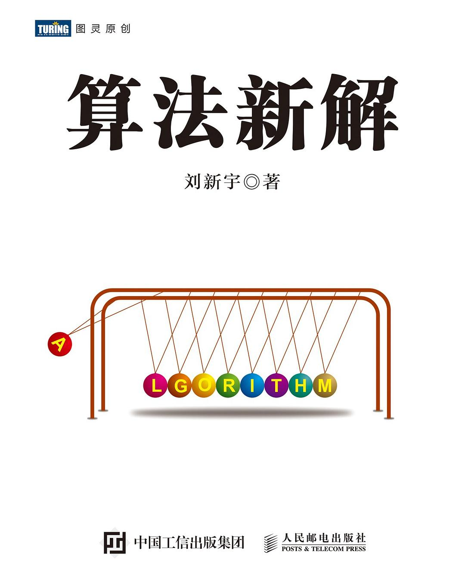
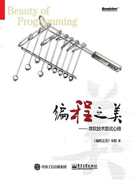

# 附录

## 参考文章

[^1]: ["Definition of ALGORITHM"](https://www.merriam-webster.com/dictionary/algorithm). *Merriam-Webster Online Dictionary*. [Archived](https://web.archive.org/web/20200214074446/https://www.merriam-webster.com/dictionary/algorithm) from the original on February 14, 2020. Retrieved November 14, 2019.
[^2]: Introduction to Algorithm 中文译作《算法导论》
[^3]: 主要参考文档 https://en.wikipedia.org/wiki/Binary_search_algorithm
[^4]: 图片及概念均摘自 Introduction to Algorithm 4th，3.1节，3.2 节
[^5]: 图片引用自 wikipedia linkedlist 条目，https://en.wikipedia.org/wiki/Linked_list

[^6]: 也称为 Pascal's triangle https://en.wikipedia.org/wiki/Pascal%27s_triangle

[^7]: [递归求解斐波那契数列的时间复杂度——几种简洁证明 - 知乎 (zhihu.com)](https://zhuanlan.zhihu.com/p/257214075)
[^8]: Fibonacci 介绍：https://en.wikipedia.org/wiki/Fibonacci_number
[^9]: [几种计算Fibonacci数列算法的时间复杂度比较 - 知乎 (zhihu.com)](https://zhuanlan.zhihu.com/p/165877869)
[^10]: 几种斐波那契数列算法比较 [Fast Fibonacci algorithms (nayuki.io)](https://www.nayuki.io/page/fast-fibonacci-algorithms)

[^11]: 我知道的有 C++，Scala
[^12]: jdk 版本有关，64 位 jdk，按 8 字节对齐
[^13]: 汉诺塔图片资料均来自 https://en.wikipedia.org/wiki/Tower_of_Hanoi
[^14]: 与主定理类似的还有 Akra–Bazzi method，https://en.wikipedia.org/wiki/Akra%E2%80%93Bazzi_method

[^15]: 龟兔赛跑动画来自于 [Floyd's Hare and Tortoise Algorithm Demo - One Step! Code (onestepcode.com)](https://onestepcode.com/floyd-hare-tortoise-algorithm-demo/)

[^16]: Josephus problem 主要参考 https://en.wikipedia.org/wiki/Josephus_problem

[^17]: KMP 算法中 next 数组的说明 [KMP算法的Next数组详解 - 唐小喵 - 博客园 (cnblogs.com)](https://www.cnblogs.com/tangzhengyue/p/4315393.html)

## 推荐图书

### 入门图书

### 系统学习

  

  

### 扩展阅读

  

  

### 面试

  

### 案头装 B

  

> 吐槽
>
> - 英文版封面设计本来挺好看的，机工非要套个黑壳子

## 力扣高评价题目列表

  引用自 [面试最常考的 100 道算法题分类整理！ - 知乎 (zhihu.com)](https://zhuanlan.zhihu.com/p/449686402)

> 带 ✔️ 是本课程讲解过的

- **[1. Two Sum (两数之和)](https://link.zhihu.com/?target=https%3A//leetcode-cn.com/problems/two-sum/)**, Easy, 11757 likes ✔️
- **[2. Add Two Numbers (两数相加)](https://link.zhihu.com/?target=https%3A//leetcode-cn.com/problems/add-two-numbers/)**, Medium, 6524 likes ✔️
- **[3. Longest Substring Without Repeating Characters (无重复字符的最长子串)](https://link.zhihu.com/?target=https%3A//leetcode-cn.com/problems/longest-substring-without-repeating-characters/)**, Medium, 5845 likes ✔️
- **[4. Median of Two Sorted Arrays (寻找两个正序数组的中位数)](https://link.zhihu.com/?target=https%3A//leetcode-cn.com/problems/median-of-two-sorted-arrays/)**, Hard, 4303 likes
- **[5. Longest Palindromic Substring (最长回文子串)](https://link.zhihu.com/?target=https%3A//leetcode-cn.com/problems/longest-palindromic-substring/)**, Medium, 3896 likes ✔️
- **[15. 3Sum (三数之和)](https://link.zhihu.com/?target=https%3A//leetcode-cn.com/problems/3sum/)**, Medium, 3582 likes ✔️
- **[53. Maximum Subarray (最大子序和)](https://link.zhihu.com/?target=https%3A//leetcode-cn.com/problems/maximum-subarray/)**, Easy, 3533 likes
- **[7. Reverse Integer (整数反转)](https://link.zhihu.com/?target=https%3A//leetcode-cn.com/problems/reverse-integer/)**, Easy, 2970 likes
- **[11. Container With Most Water (盛最多水的容器)](https://link.zhihu.com/?target=https%3A//leetcode-cn.com/problems/container-with-most-water/)**, Medium, 2659 likes ✔️
- **[42. Trapping Rain Water (接雨水)](https://link.zhihu.com/?target=https%3A//leetcode-cn.com/problems/trapping-rain-water/)**, Hard, 2552 likes ✔️
- **[20. Valid Parentheses (有效的括号)](https://link.zhihu.com/?target=https%3A//leetcode-cn.com/problems/valid-parentheses/)**, Easy, 2544 likes ✔️
- **[10. Regular Expression Matching (正则表达式匹配)](https://link.zhihu.com/?target=https%3A//leetcode-cn.com/problems/regular-expression-matching/)**, Hard, 2273 likes
- **[26. Remove Duplicates from Sorted Array (删除有序数组中的重复项)](https://link.zhihu.com/?target=https%3A//leetcode-cn.com/problems/remove-duplicates-from-sorted-array/)**, Easy, 2146 likes ✔️
- **[136. Single Number (只出现一次的数字)](https://link.zhihu.com/?target=https%3A//leetcode-cn.com/problems/single-number/)**, Easy, 1958 likes ✔️
- **[22. Generate Parentheses (括号生成)](https://link.zhihu.com/?target=https%3A//leetcode-cn.com/problems/generate-parentheses/)**, Medium, 1946 likes ✔️
- **[206. Reverse Linked List (反转链表)](https://link.zhihu.com/?target=https%3A//leetcode-cn.com/problems/reverse-linked-list/)**, Easy, 1886 likes ✔️
- **[21. Merge Two Sorted Lists (合并两个有序链表)](https://link.zhihu.com/?target=https%3A//leetcode-cn.com/problems/merge-two-sorted-lists/)**, Easy, 1832 likes ✔️
- **[70. Climbing Stairs (爬楼梯)](https://link.zhihu.com/?target=https%3A//leetcode-cn.com/problems/climbing-stairs/)**, Easy, 1791 likes ✔️
- **[300. Longest Increasing Subsequence (最长递增子序列)](https://link.zhihu.com/?target=https%3A//leetcode-cn.com/problems/longest-increasing-subsequence/)**, Medium, 1773 likes ✔️
- **[121. Best Time to Buy and Sell Stock (买卖股票的最佳时机)](https://link.zhihu.com/?target=https%3A//leetcode-cn.com/problems/best-time-to-buy-and-sell-stock/)**, Easy, 1766 likes ✔️
- **[72. Edit Distance (编辑距离)](https://link.zhihu.com/?target=https%3A//leetcode-cn.com/problems/edit-distance/)**, Hard, 1743 likes
- **[14. Longest Common Prefix (最长公共前缀)](https://link.zhihu.com/?target=https%3A//leetcode-cn.com/problems/longest-common-prefix/)**, Easy, 1707 likes ✔️
- **[198. House Robber (打家劫舍)](https://link.zhihu.com/?target=https%3A//leetcode-cn.com/problems/house-robber/)**, Medium, 1585 likes ✔️
- **[9. Palindrome Number (回文数)](https://link.zhihu.com/?target=https%3A//leetcode-cn.com/problems/palindrome-number/)**, Easy, 1568 likes
- **[146. LRU Cache (LRU 缓存机制)](https://link.zhihu.com/?target=https%3A//leetcode-cn.com/problems/lru-cache/)**, Medium, 1544 likes ✔️
- **[19. Remove Nth Node From End of List (删除链表的倒数第 N 个结点)](https://link.zhihu.com/?target=https%3A//leetcode-cn.com/problems/remove-nth-node-from-end-of-list/)**, Medium, 1494 likes ✔️
- **[33. Search in Rotated Sorted Array (搜索旋转排序数组)](https://link.zhihu.com/?target=https%3A//leetcode-cn.com/problems/search-in-rotated-sorted-array/)**, Medium, 1493 likes
- **[46. Permutations (全排列)](https://link.zhihu.com/?target=https%3A//leetcode-cn.com/problems/permutations/)**, Medium, 1484 likes ✔️
- **[101. Symmetric Tree (对称二叉树)](https://link.zhihu.com/?target=https%3A//leetcode-cn.com/problems/symmetric-tree/)**, Easy, 1483 likes ✔️
- **[84. Largest Rectangle in Histogram (柱状图中最大的矩形)](https://link.zhihu.com/?target=https%3A//leetcode-cn.com/problems/largest-rectangle-in-histogram/)**, Hard, 1472 likes
- **[39. Combination Sum (组合总和)](https://link.zhihu.com/?target=https%3A//leetcode-cn.com/problems/combination-sum/)**, Medium, 1466 likes ✔️
- **[13. Roman to Integer (罗马数字转整数)](https://link.zhihu.com/?target=https%3A//leetcode-cn.com/problems/roman-to-integer/)**, Easy, 1436 likes
- **[23. Merge k Sorted Lists (合并K个升序链表)](https://link.zhihu.com/?target=https%3A//leetcode-cn.com/problems/merge-k-sorted-lists/)**, Hard, 1436 likes ✔️
- **[17. Letter Combinations of a Phone Number (电话号码的字母组合)](https://link.zhihu.com/?target=https%3A//leetcode-cn.com/problems/letter-combinations-of-a-phone-number/)**, Medium, 1436 likes
- **[322. Coin Change (零钱兑换)](https://link.zhihu.com/?target=https%3A//leetcode-cn.com/problems/coin-change/)**, Medium, 1414 likes ✔️
- **[32. Longest Valid Parentheses (最长有效括号)](https://link.zhihu.com/?target=https%3A//leetcode-cn.com/problems/longest-valid-parentheses/)**, Hard, 1400 likes
- **[287. Find the Duplicate Number (寻找重复数)](https://link.zhihu.com/?target=https%3A//leetcode-cn.com/problems/find-the-duplicate-number/)**, Medium, 1325 likes
- **[122. Best Time to Buy and Sell Stock II (买卖股票的最佳时机 II)](https://link.zhihu.com/?target=https%3A//leetcode-cn.com/problems/best-time-to-buy-and-sell-stock-ii/)**, Easy, 1306 likes ✔️
- **[160. Intersection of Two Linked Lists (相交链表)](https://link.zhihu.com/?target=https%3A//leetcode-cn.com/problems/intersection-of-two-linked-lists/)**, Easy, 1302 likes ✔️
- **[55. Jump Game (跳跃游戏)](https://link.zhihu.com/?target=https%3A//leetcode-cn.com/problems/jump-game/)**, Medium, 1292 likes
- **[76. Minimum Window Substring (最小覆盖子串)](https://link.zhihu.com/?target=https%3A//leetcode-cn.com/problems/minimum-window-substring/)**, Hard, 1280 likes ✔️
- **[200. Number of Islands (岛屿数量)](https://link.zhihu.com/?target=https%3A//leetcode-cn.com/problems/number-of-islands/)**, Medium, 1270 likes
- **[78. Subsets (子集)](https://link.zhihu.com/?target=https%3A//leetcode-cn.com/problems/subsets/)**, Medium, 1269 likes
- **[31. Next Permutation (下一个排列)](https://link.zhihu.com/?target=https%3A//leetcode-cn.com/problems/next-permutation/)**, Medium, 1260 likes
- **[96. Unique Binary Search Trees (不同的二叉搜索树)](https://link.zhihu.com/?target=https%3A//leetcode-cn.com/problems/unique-binary-search-trees/)**, Medium, 1257 likes ✔️
- **[148. Sort List (排序链表)](https://link.zhihu.com/?target=https%3A//leetcode-cn.com/problems/sort-list/)**, Medium, 1248 likes
- **[236. Lowest Common Ancestor of a Binary Tree (二叉树的最近公共祖先)](https://link.zhihu.com/?target=https%3A//leetcode-cn.com/problems/lowest-common-ancestor-of-a-binary-tree/)**, Medium, 1238 likes ✔️
- **[25. Reverse Nodes in k-Group (K 个一组翻转链表)](https://link.zhihu.com/?target=https%3A//leetcode-cn.com/problems/reverse-nodes-in-k-group/)**, Hard, 1230 likes
- **[6. ZigZag Conversion (Z 字形变换)](https://link.zhihu.com/?target=https%3A//leetcode-cn.com/problems/zigzag-conversion/)**, Medium, 1226 likes
- **[152. Maximum Product Subarray (乘积最大子数组)](https://link.zhihu.com/?target=https%3A//leetcode-cn.com/problems/maximum-product-subarray/)**, Medium, 1223 likes
- **[215. Kth Largest Element in an Array (数组中的第K个最大元素)](https://link.zhihu.com/?target=https%3A//leetcode-cn.com/problems/kth-largest-element-in-an-array/)**, Medium, 1211 likes ✔️
- **[8. String to Integer (atoi) (字符串转换整数 (atoi))](https://link.zhihu.com/?target=https%3A//leetcode-cn.com/problems/string-to-integer-atoi/)**, Medium, 1168 likes
- **[41. First Missing Positive (缺失的第一个正数)](https://link.zhihu.com/?target=https%3A//leetcode-cn.com/problems/first-missing-positive/)**, Hard, 1163 likes
- **[283. Move Zeroes (移动零)](https://link.zhihu.com/?target=https%3A//leetcode-cn.com/problems/move-zeroes/)**, Easy, 1162 likes ✔️
- **[141. Linked List Cycle (环形链表)](https://link.zhihu.com/?target=https%3A//leetcode-cn.com/problems/linked-list-cycle/)**, Easy, 1161 likes ✔️
- **[98. Validate Binary Search Tree (验证二叉搜索树)](https://link.zhihu.com/?target=https%3A//leetcode-cn.com/problems/validate-binary-search-tree/)**, Medium, 1156 likes ✔️
- **[124. Binary Tree Maximum Path Sum (二叉树中的最大路径和)](https://link.zhihu.com/?target=https%3A//leetcode-cn.com/problems/binary-tree-maximum-path-sum/)**, Hard, 1152 likes
- **[105. Construct Binary Tree from Preorder and Inorder Traversal (从前序与中序遍历序列构造二叉树)](https://link.zhihu.com/?target=https%3A//leetcode-cn.com/problems/construct-binary-tree-from-preorder-and-inorder-traversal/)**, Medium, 1149 likes ✔️
- **[34. Find First and Last Position of Element in Sorted Array (在排序数组中查找元素的第一个和最后一个位置)](https://link.zhihu.com/?target=https%3A//leetcode-cn.com/problems/find-first-and-last-position-of-element-in-sorted-array/)**, Medium, 1137 likes ✔️
- **[239. Sliding Window Maximum (滑动窗口最大值)](https://link.zhihu.com/?target=https%3A//leetcode-cn.com/problems/sliding-window-maximum/)**, Hard, 1114 likes ✔️
- **[142. Linked List Cycle II (环形链表 II)](https://link.zhihu.com/?target=https%3A//leetcode-cn.com/problems/linked-list-cycle-ii/)**, Medium, 1097 likes ✔️
- **[139. Word Break (单词拆分)](https://link.zhihu.com/?target=https%3A//leetcode-cn.com/problems/word-break/)**, Medium, 1097 likes
- **[45. Jump Game II (跳跃游戏 II)](https://link.zhihu.com/?target=https%3A//leetcode-cn.com/problems/jump-game-ii/)**, Medium, 1094 likes
- **[169. Majority Element (多数元素)](https://link.zhihu.com/?target=https%3A//leetcode-cn.com/problems/majority-element/)**, Easy, 1089 likes
- **[234. Palindrome Linked List (回文链表)](https://link.zhihu.com/?target=https%3A//leetcode-cn.com/problems/palindrome-linked-list/)**, Easy, 1072 likes ✔️
- **[62. Unique Paths (不同路径)](https://link.zhihu.com/?target=https%3A//leetcode-cn.com/problems/unique-paths/)**, Medium, 1072 likes ✔️
- **[189. Rotate Array (旋转数组)](https://link.zhihu.com/?target=https%3A//leetcode-cn.com/problems/rotate-array/)**, Medium, 1057 likes
- **[94. Binary Tree Inorder Traversal (二叉树的中序遍历)](https://link.zhihu.com/?target=https%3A//leetcode-cn.com/problems/binary-tree-inorder-traversal/)**, Easy, 1052 likes ✔️
- **[56. Merge Intervals (合并区间)](https://link.zhihu.com/?target=https%3A//leetcode-cn.com/problems/merge-intervals/)**, Medium, 1051 likes
- **[88. Merge Sorted Array (合并两个有序数组)](https://link.zhihu.com/?target=https%3A//leetcode-cn.com/problems/merge-sorted-array/)**, Easy, 1041 likes ✔️
- **[560. Subarray Sum Equals K (和为K的子数组)](https://link.zhihu.com/?target=https%3A//leetcode-cn.com/problems/subarray-sum-equals-k/)**, Medium, 1036 likes
- **[279. Perfect Squares (完全平方数)](https://link.zhihu.com/?target=https%3A//leetcode-cn.com/problems/perfect-squares/)**, Medium, 1035 likes
- **[35. Search Insert Position (搜索插入位置)](https://link.zhihu.com/?target=https%3A//leetcode-cn.com/problems/search-insert-position/)**, Easy, 1005 likes ✔️
- **[24. Swap Nodes in Pairs (两两交换链表中的节点)](https://link.zhihu.com/?target=https%3A//leetcode-cn.com/problems/swap-nodes-in-pairs/)**, Medium, 996 likes
- **[85. Maximal Rectangle (最大矩形)](https://link.zhihu.com/?target=https%3A//leetcode-cn.com/problems/maximal-rectangle/)**, Hard, 983 likes
- **[28. Implement strStr() (实现 strStr())](https://link.zhihu.com/?target=https%3A//leetcode-cn.com/problems/implement-strstr/)**, Easy, 982 likes ✔️
- **[92. Reverse Linked List II (反转链表 II)](https://link.zhihu.com/?target=https%3A//leetcode-cn.com/problems/reverse-linked-list-ii/)**, Medium, 980 likes
- **[155. Min Stack (最小栈)](https://link.zhihu.com/?target=https%3A//leetcode-cn.com/problems/min-stack/)**, Easy, 979 likes ✔️
- **[79. Word Search (单词搜索)](https://link.zhihu.com/?target=https%3A//leetcode-cn.com/problems/word-search/)**, Medium, 979 likes
- **[27. Remove Element (移除元素)](https://link.zhihu.com/?target=https%3A//leetcode-cn.com/problems/remove-element/)**, Easy, 967 likes
- **[51. N-Queens (N 皇后)](https://link.zhihu.com/?target=https%3A//leetcode-cn.com/problems/n-queens/)**, Hard, 965 likes ✔️
- **[75. Sort Colors (颜色分类)](https://link.zhihu.com/?target=https%3A//leetcode-cn.com/problems/sort-colors/)**, Medium, 961 likes
- **[102. Binary Tree Level Order Traversal (二叉树的层序遍历)](https://link.zhihu.com/?target=https%3A//leetcode-cn.com/problems/binary-tree-level-order-traversal/)**, Medium, 960 likes ✔️
- **[48. Rotate Image (旋转图像)](https://link.zhihu.com/?target=https%3A//leetcode-cn.com/problems/rotate-image/)**, Medium, 960 likes
- **[95. Unique Binary Search Trees II (不同的二叉搜索树 II)](https://link.zhihu.com/?target=https%3A//leetcode-cn.com/problems/unique-binary-search-trees-ii/)**, Medium, 955 likes
- **[64. Minimum Path Sum (最小路径和)](https://link.zhihu.com/?target=https%3A//leetcode-cn.com/problems/minimum-path-sum/)**, Medium, 954 likes
- **[406. Queue Reconstruction by Height (根据身高重建队列)](https://link.zhihu.com/?target=https%3A//leetcode-cn.com/problems/queue-reconstruction-by-height/)**, Medium, 947 likes
- **[226. Invert Binary Tree (翻转二叉树)](https://link.zhihu.com/?target=https%3A//leetcode-cn.com/problems/invert-binary-tree/)**, Easy, 941 likes ✔️
- **[437. Path Sum III (路径总和 III)](https://link.zhihu.com/?target=https%3A//leetcode-cn.com/problems/path-sum-iii/)**, Medium, 937 likes
- **[104. Maximum Depth of Binary Tree (二叉树的最大深度)](https://link.zhihu.com/?target=https%3A//leetcode-cn.com/problems/maximum-depth-of-binary-tree/)**, Easy, 937 likes ✔️
- **[237. Delete Node in a Linked List (删除链表中的节点)](https://link.zhihu.com/?target=https%3A//leetcode-cn.com/problems/delete-node-in-a-linked-list/)**, Easy, 936 likes ✔️
- **[337. House Robber III (打家劫舍 III)](https://link.zhihu.com/?target=https%3A//leetcode-cn.com/problems/house-robber-iii/)**, Medium, 929 likes
- **[18. 4Sum (四数之和)](https://link.zhihu.com/?target=https%3A//leetcode-cn.com/problems/4sum/)**, Medium, 918 likes ✔️
- **[91. Decode Ways (解码方法)](https://link.zhihu.com/?target=https%3A//leetcode-cn.com/problems/decode-ways/)**, Medium, 904 likes
- **[207. Course Schedule (课程表)](https://link.zhihu.com/?target=https%3A//leetcode-cn.com/problems/course-schedule/)**, Medium, 897 likes
- **[37. Sudoku Solver (解数独)](https://link.zhihu.com/?target=https%3A//leetcode-cn.com/problems/sudoku-solver/)**, Hard, 897 likes ✔️
- **[175. Combine Two Tables (组合两个表)](https://link.zhihu.com/?target=https%3A//leetcode-cn.com/problems/combine-two-tables/)**, Easy, 891 likes
- **[416. Partition Equal Subset Sum (分割等和子集)](https://link.zhihu.com/?target=https%3A//leetcode-cn.com/problems/partition-equal-subset-sum/)**, Medium, 886 likes
- **[238. Product of Array Except Self (除自身以外数组的乘积)](https://link.zhihu.com/?target=https%3A//leetcode-cn.com/problems/product-of-array-except-self/)**, Medium, 885 likes
- **[114. Flatten Binary Tree to Linked List (二叉树展开为链表)](https://link.zhihu.com/?target=https%3A//leetcode-cn.com/problems/flatten-binary-tree-to-linked-list/)**, Medium, 877 likes 